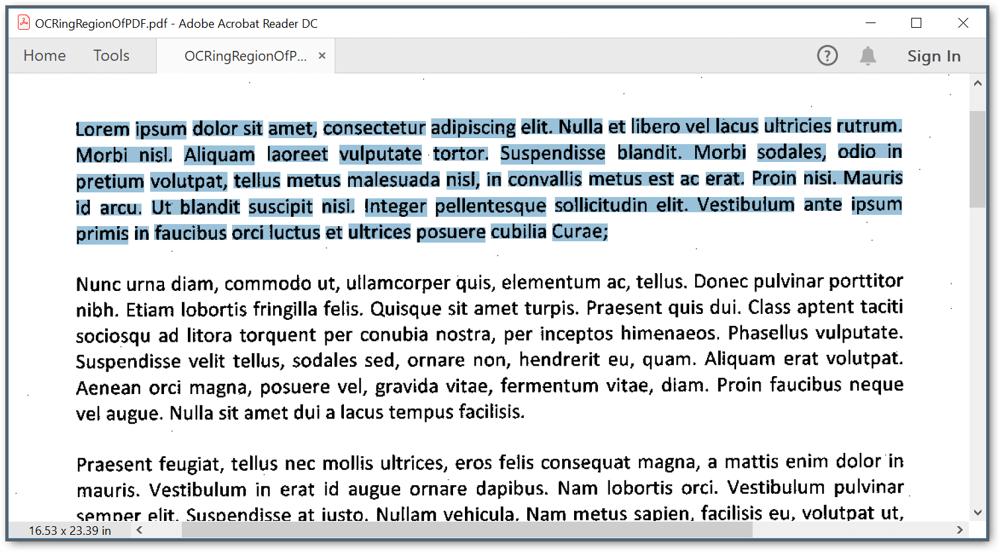
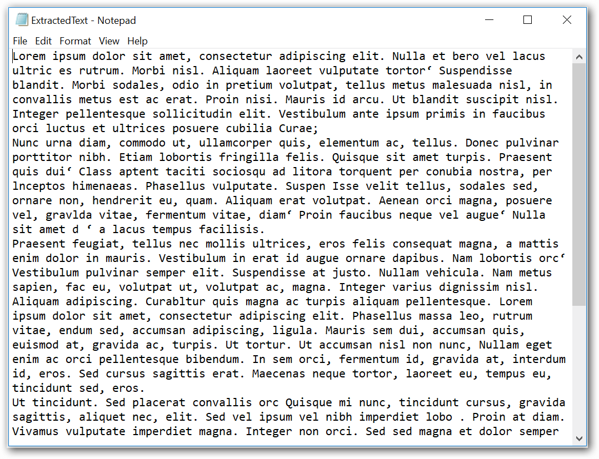
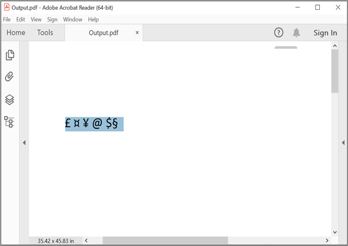

# Optical Character Recognition (OCR) Made Easy with Syncfusion&reg; OCR processor library

Optical Character Recognition (OCR) technology plays a vital role in transforming printed or handwritten text into editable and searchable content.The Syncfusion&reg; OCR processor library have extended support to process OCR on scanned PDF documents and images with the help of Google's Tesseract Optical Character Recognition engine. Within this repository, you'll find various examples demonstrating OCR performance on scanned PDF documents, showcasing different available options. Those options are, 

* OCR for an entire scanned paper document  
* OCR for a region of the scanned PDF document 
* OCR an image and convert it to a PDF document  
* OCR on rotated page of PDF document  
* Get OCRed text and bounds from scanned PDF document  
* Perform OCR with Unicode characters  

Sample name | Description
--- | ---
[OCR on entire PDF](https://github.com/SyncfusionExamples/ocr-examples-csharp/tree/master/OCR-on-entire-PDF-document) | Convert the entire scanned PDF document into searchable PDF document. 
[OCR for region of PDF](https://github.com/SyncfusionExamples/ocr-examples-csharp/tree/master/OCR-on-region-of-PDF-document) | Convert the region of scanned PDF document into searchable PDF document. 
[OCR on image and convert to PDF](https://github.com/SyncfusionExamples/ocr-examples-csharp/tree/master/OCR-on-image-and-convert-to-PDF-document) | Convert a scanned image into a searchable and selectable PDF document. 
[OCR on rotated PDF](https://github.com/SyncfusionExamples/ocr-examples-csharp/tree/master/OCR-on-rotated-PDF-document) | Convert rotated scanned PDF document into searchable PDF document. 
[Get OCRed text and bounds from scanned PDF](https://github.com/SyncfusionExamples/ocr-examples-csharp/tree/master/Get-OCR-text-and-its-bounds-from-PDF) | Retrieve OCR'ed text and its bounds from a scanned PDF document. 
[OCR on unicode characters](https://github.com/SyncfusionExamples/ocr-examples-csharp/tree/master/Perform-OCR-with-unicode-characters-in-a-PDF-document) | Perform OCR with Unicode characters in image file. 

## OCR for an entire scanned PDF document

Leveraging our library, you can effortlessly transform a complete scanned PDF document into a searchable PDF, enabling quick and efficient access to the extracted textual content.

```csharp

//Initialize the OCR processor. 
using (OCRProcessor processor = new OCRProcessor()) 
{ 
    //Load an existing PDF document. 
    FileStream inputPDFstream = new FileStream("Input.pdf", FileMode.Open); 
    PdfLoadedDocument document = new PdfLoadedDocument(inputPDFstream); 
    //Set OCR language. 
    processor.Settings.Language = "lat"; 
    //Perform OCR with input document. 
    processor.PerformOCR(document, "Tessdata/");   
    //Create file stream. 
    using (FileStream outputFileStream = new FileStream("Output.pdf", FileMode.Create, FileAccess.ReadWrite)) 
    { 
        //Save the PDF document to file stream. 
        document.Save(outputFileStream); 
    } 
}

```

By executing this code example, you will get a PDF document like in the following screenshot.


## OCR for a region of the scanned PDF document 

Our library empowers you to conduct OCR on specific regions, or multiple regions of a scanned PDF document effortlessly. 

```csharp

//Initialize the OCR processor. 
using (OCRProcessor processor = new OCRProcessor()) 
{ 
    //Load a PDF document. 
    FileStream inputPDFStream = new FileStream("Input.pdf", FileMode.Open); 
    PdfLoadedDocument loadedDocument = new PdfLoadedDocument(inputPDFStream); 
    //Set OCR language to process. 
    processor.Settings.Language = "lat"; 
    RectangleF rectangle = new RectangleF(0, 100, 950, 150); 
    //Assign rectangles to the page. 
    List<PageRegion> pageRegions = new List<PageRegion>(); 
    PageRegion region = new PageRegion(); 
    region.PageIndex = 0; 
    region.PageRegions = new RectangleF[] { rectangle }; 
    pageRegions.Add(region); 
    processor.Settings.Regions = pageRegions; 
    //Process OCR by providing the PDF document. 
    processor.PerformOCR(loadedDocument, "Tessdata/"); 
    //Create file stream. 
    using (FileStream outputFileStream = new FileStream("Output.pdf", FileMode.Create, FileAccess.ReadWrite)) 
    { 
        //Save the PDF document to file stream. 
        loadedDocument.Save(outputFileStream); 
    } 
} 

```

By executing this code example, you will get a PDF document like in the following screenshot.


## OCR on image and convert it to a PDF document  

With the aid of our library, any scanned image can be transformed into a searchable and selectable PDF document with ease.

```csharp

//Initialize the OCR processor. 
using (OCRProcessor processor = new OCRProcessor()) 
{ 
    //Get stream from an image file.  
    FileStream imageStream = new FileStream(@"Input.jpg", FileMode.Open); 
    //Set OCR language to process. 
    processor.Settings.Language = Languages.English; 
    //Process OCR by providing the bitmap image.   
    PdfDocument document = processor.PerformOCR(imageStream); 
    //Create file stream. 
    using (FileStream outputFileStream = new FileStream(@"Output.pdf", FileMode.Create, FileAccess.ReadWrite)) 
    { 
        //Save the PDF document to file stream. 
        document.Save(outputFileStream); 
    } 
}

```

By executing this code example, you will get a PDF document like in the following screenshot.


## OCR on rotated page of PDF document  

Here is the code example demonstrating how to perform OCR on a rotated PDF document. 

```csharp

//Initialize the OCR processor. 
using (OCRProcessor processor = new OCRProcessor()) 
{ 
    //Load an existing PDF document. 
    FileStream stream = new FileStream("Input.pdf", FileMode.Open); 
    PdfLoadedDocument document = new PdfLoadedDocument(stream); 
    //Set OCR language. 
    processor.Settings.Language = "lat"; 
    //Set OCR page auto detection rotation. 
    processor.Settings.PageSegment = PageSegMode.AutoOsd; 
    //Perform OCR with input document and tessdata (Language packs). 
    string extractedText = processor.PerformOCR(document, "Tessdata/"); 
    //Writes the text to the file. 
    File.WriteAllText("OCR.txt", extractedText); 
}

```

By executing this code example, you will get a text document like in the following screenshot.


## Get OCRed text and bounds from scanned PDF document  

By utilizing our library, you can easily obtain OCRed text and its corresponding bounds from a scanned PDF document. 

```csharp

//Initialize the OCR processor. 
using (OCRProcessor processor = new OCRProcessor()) 
{ 
    //Load an existing PDF document. 
    FileStream stream = new FileStream("Input.pdf", FileMode.Open); 
    PdfLoadedDocument document = new PdfLoadedDocument(stream); 
    //Set OCR language. 
    processor.Settings.Language = "lat"; 
    //Create the layout result.  
    OCRLayoutResult layoutResult = new OCRLayoutResult(); 
    //Perform OCR with input document and tessdata (Language packs). 
    processor.PerformOCR(document, @"Tessdata/", out layoutResult); 
    //Get OCRed line collection from first page. 
    OCRLineCollection lines = layoutResult.Pages[0].Lines; 
    //Get each OCR'ed line and its bounds. 
    foreach (Line line in lines) 
    { 
        string text = line.Text; 
        RectangleF bounds = line.Rectangle; 
    } 
    //Close the document. 
    document.Close(true); 
} 

```

## Perform OCR with Unicode characters 

Below is the code example demonstrating how to perform OCR with Unicode characters in image file.  

```csharp

//Initialize the OCR processor by providing the path of tesseract. 
using (OCRProcessor processor = new OCRProcessor()) 
{ 
    //Get stream from an existing PDF document.  
    FileStream stream = new FileStream(Path.GetFullPath(@"UnicodePDF.pdf"), FileMode.Open); 
    //Load the PDF document.  
    PdfLoadedDocument loadedDocument = new PdfLoadedDocument(stream); 
    //Sets Unicode font to preserve the Unicode characters in a PDF document. 
    FileStream fontStream = new FileStream(Path.GetFullPath(@"ARIALUNI.ttf"), FileMode.Open); 
    //Set the font for unicode text.  
    processor.UnicodeFont = new PdfTrueTypeFont(fontStream, 8); 
    //Set OCR language to process 
    processor.Settings.Language = Languages.English; 
    //Process OCR by providing the PDF document. 
    string ocrText = processor.PerformOCR(loadedDocument); 
    //Create file stream. 
    using (FileStream outputFileStream = new FileStream(Path.GetFullPath(@"Output.pdf"), FileMode.Create, FileAccess.ReadWrite)) 
    { 
        //Save the PDF document to file stream. 
        loadedDocument.Save(outputFileStream); 
    } 
} 

```

By executing this code example, you will get a text document like in the following screenshot.


# How to run the examples
* Download this project to a location in your disk. 
* Open the solution file using Visual Studio. 
* Rebuild the solution to install the required NuGet package. 
* Run the application.

# Resources
*   **Product page:** [Syncfusion&reg; PDF Framework](https://www.syncfusion.com/document-processing/pdf-framework/net)
*   **Documentation page:** [Syncfusion&reg; .NET PDF library](https://help.syncfusion.com/file-formats/pdf/overview)
*   **Online demo:** [Syncfusion&reg; .NET PDF library - Online demos](https://ej2.syncfusion.com/aspnetcore/PDF/CompressExistingPDF#/bootstrap5)
*   **Blog:** [Syncfusion&reg; .NET PDF library - Blog](https://www.syncfusion.com/blogs/category/pdf)
*   **Knowledge Base:** [Syncfusion&reg; .NET PDF library - Knowledge Base](https://www.syncfusion.com/kb/windowsforms/pdf)
*   **EBooks:** [Syncfusion&reg; .NET PDF library - EBooks](https://www.syncfusion.com/succinctly-free-ebooks)
*   **FAQ:** [Syncfusion&reg; .NET PDF library - FAQ](https://www.syncfusion.com/faq/)

# Support and feedback
*   For any other queries, reach our [Syncfusion&reg; support team](https://www.syncfusion.com/support/directtrac/incidents/newincident?utm_source=github&utm_medium=listing&utm_campaign=github-docio-examples) or post the queries through the [community forums](https://www.syncfusion.com/forums?utm_source=github&utm_medium=listing&utm_campaign=github-docio-examples).
*   Request new feature through [Syncfusion&reg; feedback portal](https://www.syncfusion.com/feedback?utm_source=github&utm_medium=listing&utm_campaign=github-docio-examples).

# License
This is a commercial product and requires a paid license for possession or use. Syncfusion’s licensed software, including this component, is subject to the terms and conditions of [Syncfusion's EULA](https://www.syncfusion.com/eula/es/?utm_source=github&utm_medium=listing&utm_campaign=github-docio-examples). You can purchase a licnense [here](https://www.syncfusion.com/sales/products?utm_source=github&utm_medium=listing&utm_campaign=github-docio-examples) or start a free 30-day trial [here](https://www.syncfusion.com/account/manage-trials/start-trials?utm_source=github&utm_medium=listing&utm_campaign=github-docio-examples).

# About Syncfusion&reg;
Founded in 2001 and headquartered in Research Triangle Park, N.C., Syncfusion&reg; has more than 26,000+ customers and more than 1 million users, including large financial institutions, Fortune 500 companies, and global IT consultancies.

Today, we provide 1600+ components and frameworks for web ([Blazor](https://www.syncfusion.com/blazor-components?utm_source=github&utm_medium=listing&utm_campaign=github-docio-examples), [ASP.NET Core](https://www.syncfusion.com/aspnet-core-ui-controls?utm_source=github&utm_medium=listing&utm_campaign=github-docio-examples), [ASP.NET MVC](https://www.syncfusion.com/aspnet-mvc-ui-controls?utm_source=github&utm_medium=listing&utm_campaign=github-docio-examples), [ASP.NET WebForms](https://www.syncfusion.com/jquery/aspnet-webforms-ui-controls?utm_source=github&utm_medium=listing&utm_campaign=github-docio-examples), [JavaScript](https://www.syncfusion.com/javascript-ui-controls?utm_source=github&utm_medium=listing&utm_campaign=github-docio-examples), [Angular](https://www.syncfusion.com/angular-ui-components?utm_source=github&utm_medium=listing&utm_campaign=github-docio-examples), [React](https://www.syncfusion.com/react-ui-components?utm_source=github&utm_medium=listing&utm_campaign=github-docio-examples), [Vue](https://www.syncfusion.com/vue-ui-components?utm_source=github&utm_medium=listing&utm_campaign=github-docio-examples), and [Flutter](https://www.syncfusion.com/flutter-widgets?utm_source=github&utm_medium=listing&utm_campaign=github-docio-examples)), mobile ([Xamarin](https://www.syncfusion.com/xamarin-ui-controls?utm_source=github&utm_medium=listing&utm_campaign=github-docio-examples), [Flutter](https://www.syncfusion.com/flutter-widgets?utm_source=github&utm_medium=listing&utm_campaign=github-docio-examples), [UWP](https://www.syncfusion.com/uwp-ui-controls?utm_source=github&utm_medium=listing&utm_campaign=github-docio-examples), and [JavaScript](https://www.syncfusion.com/javascript-ui-controls?utm_source=github&utm_medium=listing&utm_campaign=github-docio-examples)), and desktop development ([WinForms](https://www.syncfusion.com/winforms-ui-controls?utm_source=github&utm_medium=listing&utm_campaign=github-docio-examples), [WPF](https://www.syncfusion.com/wpf-ui-controls?utm_source=github&utm_medium=listing&utm_campaign=github-docio-examples), [WinUI(Preview)](https://www.syncfusion.com/winui-controls?utm_source=github&utm_medium=listing&utm_campaign=github-docio-examples), [Flutter](https://www.syncfusion.com/flutter-widgets?utm_source=github&utm_medium=listing&utm_campaign=github-docio-examples) and [UWP](https://www.syncfusion.com/uwp-ui-controls?utm_source=github&utm_medium=listing&utm_campaign=github-docio-examples)). We provide ready-to-deploy enterprise software for dashboards, reports, data integration, and big data processing. Many customers have saved millions in licensing fees by deploying our software.